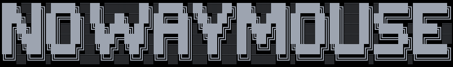
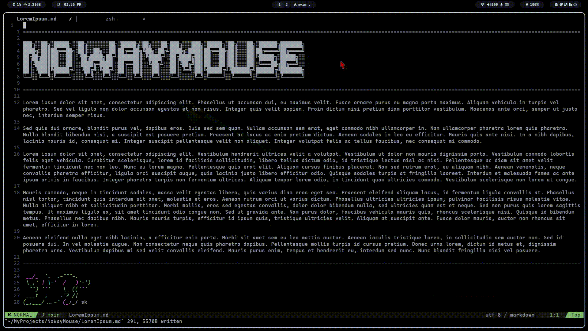
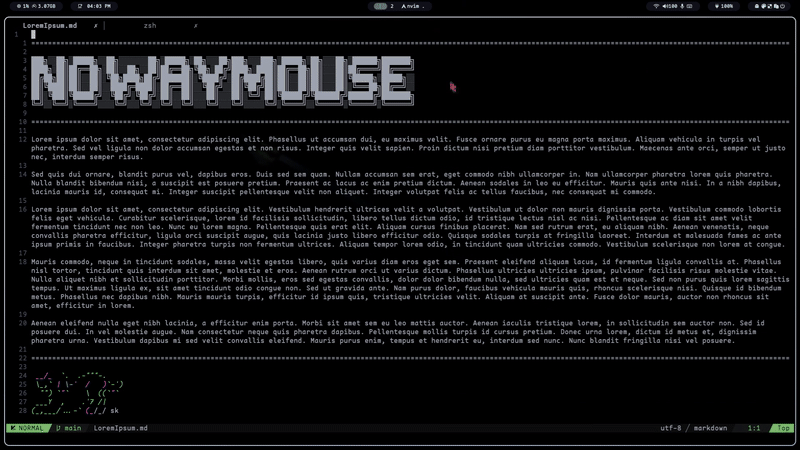

**nowaymouse** provides effective keyboard-based control of mouse position, movements and actions on wlroots-based [**wayland compositors**](https://wiki.archlinux.org/title/Wayland)(works on Sway, Hyprland, Wayfire, etc).

## Show Case
### Mouse Mode
When you activate **Mouse Mode**, you can move the mouse pointer around, as well as click and scroll.



### Div Mode
When you activate **Division Mode**, the screen is divided into a grid, and you can precisely choose where the mouse pointer should jump through multiple divisions.



---

## How to Install and run

### Installation:
If you are on an Arch-Based distribution, you can install directly from AUR. For example, using `yay`: 
```bash
yay -S nowaymouse-git
```

Alternatively, you can build from the `PKGBUILD` file included in this repository: 
```bash
git clone https://github.com/Neal-Ning/nowaymouse.git
cd  nowaymouse
makepkg -si
```

### Running:

**Note**: Before running nowaymouse, make sure you have completed the [required step](#required-step-keyboard-path-configuration) described in the [Config](#config) section.

You can run nowaymouse with: 
```bash
sudo -E nowaymouse
```
- `sudo` is necessary for nowaymouse to access keyboard input devices;
- `-E` preserves your user environment variables, which nowaymouse needs to run.

---

## Config

The default config (all configrable variables) is available at `nowaymouse/default.yaml`.
To customize settings, create a configuration file at `~/.config/nowaymouse/config.yaml`.

```diff
- Important:
- You must override the keyboard_input_path variable in your configuration. 
- Without this, nowaymouse won't know where to listen for keyboard input.
```

You may also override any other variables by defining them in `~/.config/nowaymouse/config.yaml`.

---

### ❗Required Step: Keyboard Path Configuration❗
The application needs to know which input device corresponds to your keyboard. To set this up:
1. Install evtest (via `apt`, `pacman`, or any package manager of choice)
2. Run:
    ```
    sudo evtest
    ```
3. Identify the path of your keyboard device from the listed input devices
    - If multiple keyboards are listed, select each by number and press keys to see if they register.
4. Append the following line to your `~/.config/nowaymouse/config.yaml`:  
   ```yaml
   keyboard_input_path: /dev/input/eventX
    ```
---

### Activation Key Keybinds
**Mouse Mode** is activated by pressing the key defined in the `activation_key` variable. 
- In Mouse Mode, you can move the pointer, click and scroll with the defined keys.
- Note: Once nowaymouse is running, the chosen activationkey will not perform its original function.

**Div(Division) Mode** is activated by pressing the key defined in the `activation_division_overlay_key` variable.
- You must first enter Mouse Mode before activating Div Mode.
- A future update may allow Div Mode to be activated directly without being in Mouse Mode.

---

### Overlay Config
The default behavior defined in `nowaymouse/default.yaml` entails: When you press the `activation_division_overlay_key`, an overlay grid covers the screen, where each grid cell contains a unique combination of letters called **navigators**.
- Typing out a navigator sequence splits the corresponding grid into smaller grid cells;
- Each smaller grid cell is labeled with a single-letter navigator;
- Then typing a letter moves the mouse pointer the center of the corresponding smaller grid cell. 
- The mouse automatically left click once at its new position, and exits Div Mode.

#### Configrable options:
- `screen_x_resolution`, `screen_y_resolution`: -> Define yoru screen resolution;
- `number_of_divisions` -> Define the depth of recursive grid splitting;
- `division_dimensions` -> Define the grid size (columns, rows) at each division;
- `division_navigators` -> Define the set of characters used as navigators;
- `click_after_select` -> Whether to automatically click after selecting the final grid;
- `mouse_mode_after_select` -> Whether to stay in Mouse Mode after selection. 
> Note: Ensure `number_of_divisions`, `division_dimensions`, and `division_navigators` are consistent.

---

## Extra Notes
Currently, nowaymouse uses keycode for an English keybaord layout. If you use a different keyboard layout, some keys (especially punctuations, symbols, and special characters) may not match correctly.
